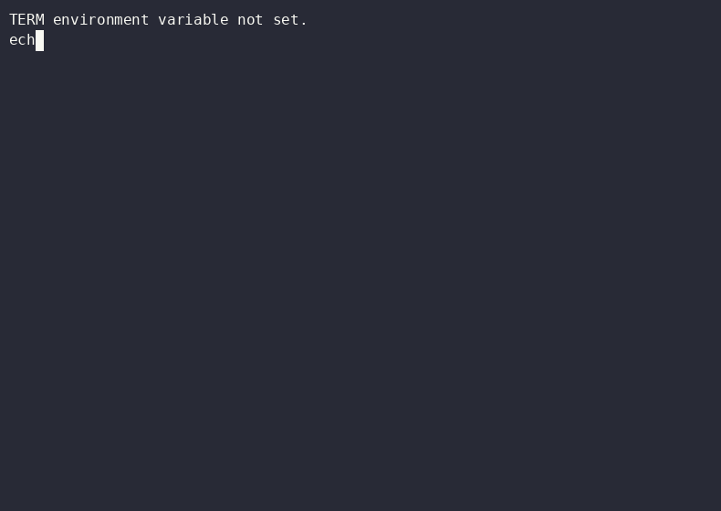

> **⚡ TURBO FLOW — THE RULES LAYER FOR AI-WRITTEN CODE.**
> One product lives here: [`rig-lite/`](rig-lite/) — a portable governance kit. It ships no harness, installs nothing, and depends only on bash. Drop it into any repo and your agents get laws with teeth.

   

## Bring your own harness

Turbo Flow bundles no agent and no orchestrator. It names harnesses by **role**, and works with any tool that reads `AGENTS.md` and can run bash:

| Role | Who | How the kit uses it |
|---|---|---|
| **Builder** | ZCode (GLM), Claude Code, Codex, Gemini, Grok | `gate.sh --builder <cli>` knows the family; anyone can build |
| **Reviewer** | Claude Code or Codex CLI — never the builder's family | the gate auto-detects and refuses same-family review |
| **Orchestration** (optional) | Ruflo, as a Claude Code mod | bring it if you want swarms — the kit doesn't care |

**ZCode builds · Claude Code reviews (Ruflo mod installed when you want orchestration) · Codex backs up the review.** That loop runs in production on this repo today: every PR since rig-lite landed (v5.0) was built by one family, reviewed by another, merged by a human.

## 🎬 The demo — recorded in a fresh Codespace, nothing preinstalled



A clean Codespace boots this repo's devcontainer and the kit proves itself in-container — fail-closed self-test suite and a live gate run (reviewer CLI stubbed; no API keys on the recording box). Not a mockup. The recording predates the lean pivot (it shows the repo's earlier container); the current container's `postCreate` runs the self-test directly, and the recorder now walks that flow. Reproducible via [`demo/record-rig-lite-demo.sh`](demo/record-rig-lite-demo.sh).

## The gate survived 17 rounds of review

`rig-lite/gate.sh` was itself reviewed by a model family that didn't write it — and got **REVISE'd seventeen times** before earning APPROVED (counted from the gate's own JSONL log). The findings are exactly the class the gate exists to catch: a prompt-injection hole that let a diff approve itself, a fail-open path that skipped review entirely, a quoting bug that swallowed failing tests, a silent-reviewer misdiagnosis. Every fix became a self-test. **Builder ≠ reviewer isn't a slogan in this repo — it's the reason this script is trustworthy.**

## rig-lite — one kit, ten minutes, no new dependencies

| file | what it gives you |
|---|---|
| [`gate.sh`](rig-lite/gate.sh) | a cross-model review gate — deterministic checks first (they're free), then a reviewer from a **different model family** must return a parseable `APPROVED` / `REVISE`. Fail-closed; never merges. `--pr <n>` gates a GitHub PR and posts the verdict as a comment; `--sweep` gates every open PR that has no verdict yet; `-C <repo>` gates another checkout. Every verdict lands in a local JSONL log the digest joins. |
| [`wt.sh`](rig-lite/wt.sh) | an isolated worktree per parallel writer: `wt <name>` creates `.worktrees/<name>` + branch, `--clean` tidies up after merge. |
| [`init-repo.sh`](rig-lite/init-repo.sh) | one-command onboarding for any repo: a thin `AGENTS.md` (constitution pointer + project cheat-sheet) and the `CLAUDE.md → AGENTS.md` symlink. Never clobbers existing files. |
| [`specs/`](rig-lite/specs/) | the spec + UAT contract templates: plan before build, verify behavior against the deployed app. |
| [`digest.sh`](rig-lite/digest.sh) | one command, one file: repo health for your whole fleet — merge queue joined with gate verdicts, merged PRs, dirty/behind working copies, site liveness, stale codespaces, repo-hygiene gaps. |
| [`automations/`](rig-lite/automations/README.md) | the background tier as a portable prompt pack: 9 scheduled tasks (morning digest, security scan, memory consolidation, weekly retro, repo-hygiene pass, site sentinel, gate canary, portability canary, nightly sweep) plus two ways to schedule them. |
| [`secret.sh`](rig-lite/secret.sh) | encrypted-at-rest secrets, backend auto-detected (macOS Keychain → libsecret → age → loudly-warned chmod-600 plaintext). `set/get/rm/list` — listing shows names, never values; values never appear in `ps`. |
| [`memory.md`](rig-lite/memory.md) + [`memory/`](rig-lite/memory/) | the git-versioned memory pattern: index, decisions, gotchas, project index, inbox — agents forget, git doesn't. |
| [`tokens.py`](rig-lite/tokens.py) | live token-burn dashboard across **zcode + claude + codex + gate** — reads each CLI's local usage data read-only; `--watch` live view, `--json`, TZ-pinned 32-case fixture self-test. The first open-core drop from Turbo Rig. On macOS the default run also reads the Claude OAuth token from the Keychain and calls Anthropic's usage endpoint for plan bars — `--no-quota` skips both. |
| [`hooks/pre-commit`](rig-lite/hooks/pre-commit) | deletion guard: staged deletions print loudly instead of silently vanishing. Warn-only, fail-open. |
| [`constitution.md`](rig-lite/constitution.md) | the laws — builder ≠ reviewer, agents never merge, worktrees for parallel writers, secrets encrypted, state on disk. |
| [`self-test.sh`](rig-lite/self-test.sh) | the kit's own fail-closed test suite (hundreds of checks); says so when shellcheck-gated coverage is skipped. |

## Ten-minute install

```bash
# from any repo you want to govern:
bash /path/to/turbo-flow/rig-lite/init-repo.sh   # writes AGENTS.md + symlink, never clobbers
bash /path/to/turbo-flow/rig-lite/self-test.sh   # prove the kit on your machine
/path/to/turbo-flow/rig-lite/gate.sh --pr 1 --builder <your-cli>
```

No Codespace? Fine — it's bash. Want the 30-second container tour anyway? Open this repo in a Codespace; `postCreate` runs the self-test. That's the whole install surface.

## Where the v4 environment went

Turbo Flow v4 packaged and wired a Claude Code + Ruflo environment. Ruflo grew its own onboarding (`npx ruflo@latest init wizard`, plugin marketplace, built-in memory and console), which retired the reason a wrapper repo existed. The v4 install chain lives on in the `v1.0.1 → v4.0` tags; the v5 line is governance-first and orchestration-agnostic.

## Join the private beta

The kit is the portable extract of **Turbo Rig** — gate + constitution + memory + automations running as one integrated system, on your machine, across your repos.

- **Apply / product page** → [turbo-rig.vercel.app](https://turbo-rig.vercel.app) (EN/ES)
- **Deep dive** → [turbo-rig-deep-dive.vercel.app](https://turbo-rig-deep-dive.vercel.app) · **3D scene** → [turbo-rig-deep-dive-3d.vercel.app](https://turbo-rig-deep-dive-3d.vercel.app)

**Beta feedback:** open an issue or start a discussion here — this repo is the beta's public tracker.

## Does builder ≠ reviewer actually matter?

In a controlled 116-task study, cross-family review lifted pass rates from **71.6% → 89.7%**, while same-family self-review barely moved. One recent week of building Turbo Rig with Turbo Rig: **141 PRs · 868 gate runs · 104 parallel lanes** — every merge held by a human. The badge at the top is the receipt.

## About Adventure Wave Labs

**Adventure Wave Labs** builds Turbo Flow and Turbo Rig — packaging, setup automation, and the governance layer that holds when the agents get fast. The orchestration core referenced by v4 was [Ruflo](https://github.com/ruvnet/ruflo) by rUv; Turbo Flow integrates, and now points at it, rather than rebuilding it.

<div align="center">

**Turbo Flow v5.2 — the rules layer. One kit, any harness, humans merge.**

</div>

## Ecosystem

Built with and powers these tools — star the ones you use:

| Repo | What it does |
|------|-------------|
| [**codescope**](https://github.com/adventurewave-labs/codescope) | Single-binary code-intelligence engine for AI agents — no cloud, no DB, no Python |
| [**secret-scan**](https://github.com/adventurewave-labs/secret-scan) | Rust secret scanner — obfuscation detection, up to ~1,200 files/sec measured |
| [**Sentinel**](https://github.com/marcuspat/Sentinel) | Deny-by-default agentic sysadmin: Investigate → Plan → Approve → Act in Rust |
| [**netrain**](https://github.com/marcuspat/netrain) | Matrix-style network monitor in Rust |

Orchestration, when you want it: [Ruflo](https://github.com/ruvnet/ruflo) as a Claude Code mod.

## Stay Connected

If Turbo Flow ships value for you, follow [@marcuspat](https://github.com/marcuspat) on GitHub — agentic tooling, Rust crates, and open-source infra drop regularly.

[](https://github.com/marcuspat)

## License

MIT — Copyright (c) 2025-2026 Adventure Wave Labs
